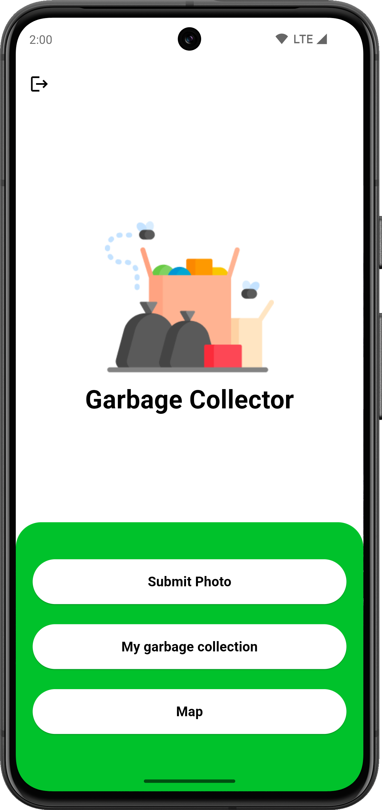
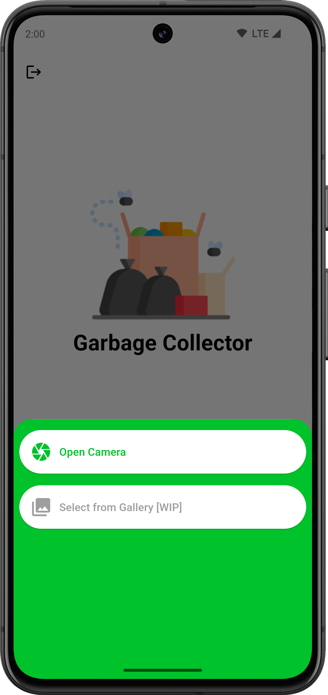
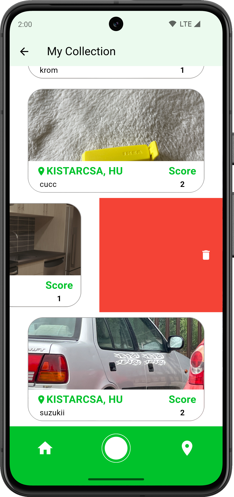

# Garbage Locator

A Flutter project to locate and publish garbage with their location shown on a map.

## Screenshots:

    <table>
	    <tr>
    	    <td style="padding:10px">
                
      	    </td>
            <td style="padding:10px">
                
            </td>
            <td style="padding:10px">
                
            </td>
        </tr>
    </table>

    <table>
	    <tr>
    	    <td style="padding:10px">
                
      	    </td>
            <td style="padding:10px">
                
            </td>
            <td style="padding:10px">
                
            </td>
        </tr>
    </table>

    <table>
	    <tr>
    	    <td style="padding:10px">
                
      	    </td>
            <td style="padding:10px">
                
            </td>
            <td style="padding:10px">
                
            </td>
        </tr>
    </table>

