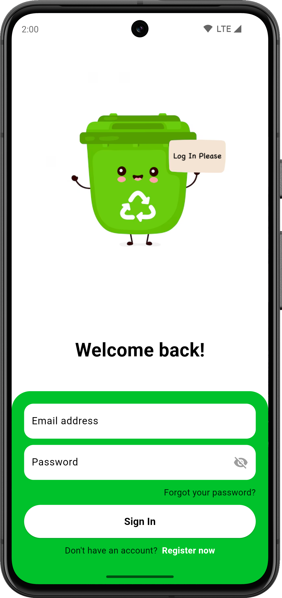
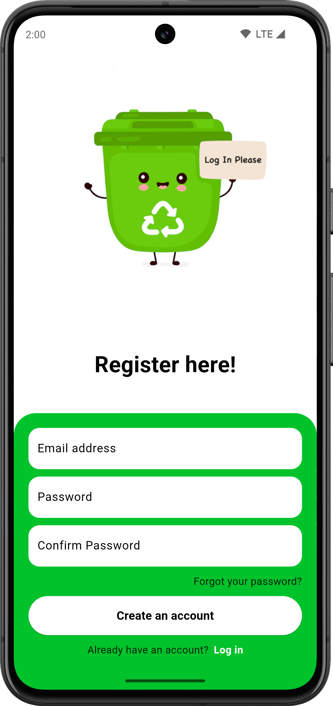
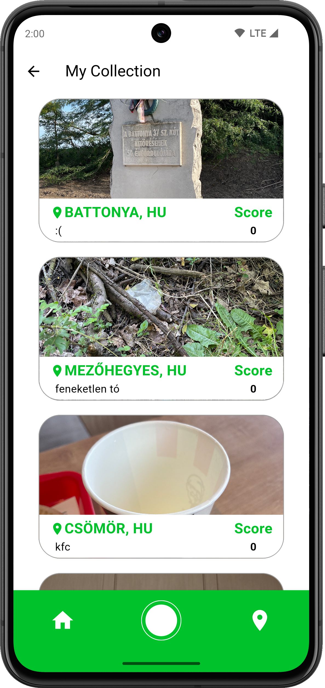

# Garbage Locator

A Flutter project to locate and publish garbage with their location shown on a map.

## Screenshots:

     

          
     

     

          
     

     

          
     

     

          
     

     

          
     

     

          
     

     

          
     

     

          
     

     

          
     

